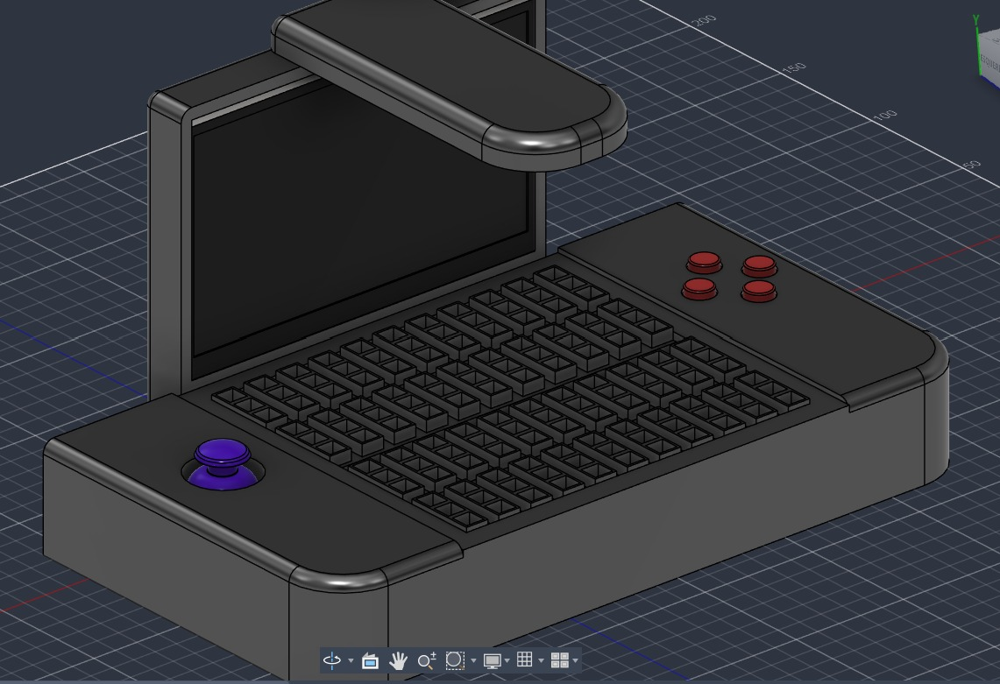
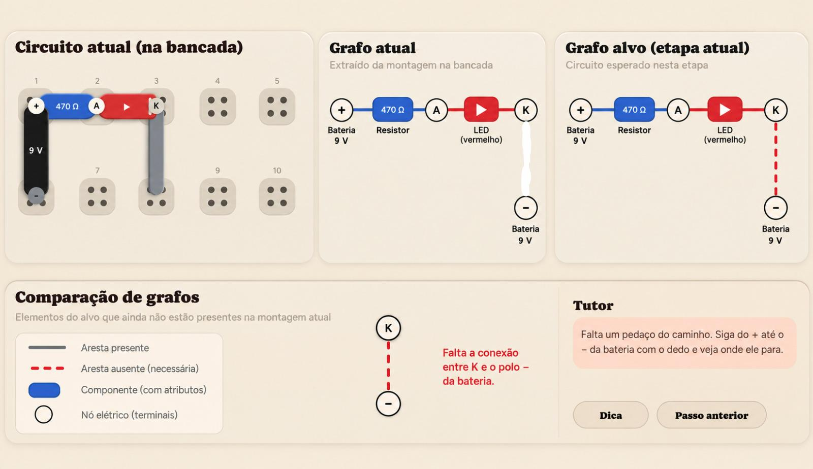

# TedThunder ⚡

An interactive electronics workbench for kids — build a real circuit with your hands, press
**Energizar**, and watch it actually work.

<table>
<tr>
<td width="50%" valign="top"></td>
<td width="50%" valign="top"></td>
</tr>
<tr>
<td align="center"><em>The bench — connection table, screen and controls</em></td>
<td align="center"><em>Guided mode — the assembled graph checked against the step's target</em></td>
</tr>
</table>

## Intro 🔌

Electricity is invisible, and that is exactly what makes it hard to teach. A student can memorize
that the long leg of an LED is the anode, that a resistor "limits current", that brown-black-red
means 1 kΩ — and still have no intuition at all about what is happening inside the wire.

TedThunder is a physical electronics workbench built for students of **Fundamental II (7th to 8th
grade)** with no prior technical background, developed under the Integration Workshop 3 at UTFPR.
Its goal is technological literacy through practical intuition: the **what** and the **why**, not
the memorization.

That means we deliberately teach cause and effect instead of rules:

- The **LED** is a one-way valve for current, not a catode/anode vocabulary exercise. Connect it
  backwards and it simply does not light — the consequence teaches the concept.
- The **buzzer** turns electricity into vibration you can hear. Change the resistance and the tone
  changes in your ears, right now.
- **Resistor color codes** are never drilled. The bench gives visual support and encourages direct
  measurement with the built-in probes instead.

### Why a physical bench instead of a simulator?

Online simulators exist and they are useful, but they lose the things that make electronics stick
for a thirteen-year-old:

- **Motor and tactile memory.** Handling components and placing them on a matrix builds
  three-dimensional spatial reasoning and manual dexterity.
- **Multisensory feedback.** Seeing the light turn on, hearing the buzzer, feeling the button
  click — real physical feedback drives engagement and retention in a way a mouse click does not.
- **Real failure, safely.** Loose contacts, reversed components, short circuits. The student
  learns to *diagnose*, which is the actual skill, in an environment that cannot hurt them.

## Project description 📋

TedThunder is a self-contained desktop unit. The student works on a **18 × 16 cm** connection
table, drops components into it, and presses a single large button to bring the circuit to life.

### The table

The connection matrix is a grid of **11 columns × 6 rows** of sockets, arranged as **two banks of
3 rows** separated by a center channel — the same idea as a breadboard, scaled up so small hands
can use it. Each bank strip is roughly 1 × 3 cm. All six sockets of a column are electrically tied
together, across both banks — the center channel separates them by hand, not by wiring. There are
no power rails; the battery is a capsule that sits on the grid like any other component.

### The components

Components are not loose parts — they are **capsules**: Lego-like blocks that encase a real
electronic component. A capsule is chunky, drop-in, impossible to insert crookedly by accident,
and carries a printed marker on top so the bench can recognize it.

The real component is genuinely inside. When the circuit is energized, real current flows through
the real LED, and the real button really opens and closes the loop.

### The interface

- A **7″ screen** shows the tutorial, the current step, the hints and the diagnosis.
- A **joystick** on one side navigates the interface.
- **4 buttons** on the other side answer quiz questions and confirm choices.
- A dedicated **Energizar** button for the teeneger to see their circuits come alive.

## How it works ⚙️

### 1. Vision — what is on the table

A low-end camera on a fixed boom about **30 cm** above the table watches the matrix. Each capsule
carries a small **QR code** as its primary identifier, with **color coding as a fallback** when the
code cannot be read. From a single frame the system extracts, for every capsule: its type, its
orientation, and which sockets it occupies.

Every scan produces a complete picture from scratch. No state is carried between cycles, so
removing a component is detected exactly as reliably as adding one.

### 2. Graph — what the student actually built

Socket positions plus the geometry of the grid are enough to derive the circuit. The result is a
graph that distinguishes:

- **electrical nodes** — the column strips whose sockets are tied together,
- **component terminals** — where each capsule touches the matrix,
- **internal edges** — the component itself, inside the capsule,
- **contact edges** — a terminal sitting in a node.

Jumpers are capsules too: fixed two-terminal bridges in **length 2** and **length 3**, each one a
single internal edge between the two sockets it spans.

### 3. Validation — is this the step?

Every step of a guided module is defined by a **target graph**, and every step introduces exactly
one kind of change: a node placement, an edge placement, or an attribute change. A step is approved
when the assembled graph contains the target graph by **subgraph isomorphism** — position on the
matrix is irrelevant, only structure matters.

When it does not match, the difference between the assembled graph and the target becomes a list
of tasks, and the tutor addresses the one belonging to the earliest step. If the student breaks
something they already finished, that regression is handled before moving forward. Extra pieces
that do not change the electrical outcome are simply tolerated.

### 4. Energization — making it real

Nothing is live until the student presses **Energizar**. Then the bench classifies the circuit:

- **Safe path** → a switch matrix under the table closes the traces and real current flows through
  the real components. The LED lights, the buzzer sounds, the button clicks, the potentiometer
  dims.
- **Hazard** — a short circuit, an over-current, a bad contact → the matrix **stays open**. Nothing
  is energized. The screen shows what *would* have happened, with the alarm and the mascot's
  reaction, and the student is walked through the diagnosis.

The approach is inspired by the
[Autoroute Breadboard](https://hackaday.io/project/197195-autoroute-breadboard-breadboard) project.

### 5. Attribute actions

The camera can't detect a pressed button or a turned potentiometer. Because the real component sits in a real powered path, the action simply works. When a step asks for one of these actions, the bench energizes the circuit and opens an **interaction window** — the screen plays the animation for that step, a potentiometer turning or a button going down, and the window lasts exactly as long as that animation and its narration. The student performs the action on the real board while it plays.

Nothing is sensed, so nothing is validated electrically. When the window closes the bench asks what happened — *"what did the light do?"* — and the student answers with the four buttons. That answer is what approves the step, and it doubles as the comprehension check: it is worth more than a sensor reading, because it confirms the student actually watched.

As the system know the circuit, it can also show the milliamps (in the later modules) from the simulation.

## Modes 🎛️

- **Guided modules.** Step-by-step construction with a target graph per step, progressive hints and
  a conceptual quiz. Ten modules, from powering the board to building an alarm.
- **Challenge versions.** Each module has a challenge twin: same target circuit, no instructions —
  or a circuit pre-assembled with a deliberate fault to find. Only the final graph is validated.
- **Creation.** Students build their own challenges and share them with each other through the
  companion mobile web app.

The companion app is deliberately **phone-first**. A teacher moving between benches in a classroom has a phone in their pocket, not a laptop under their arm, so the app is laid out for a phone screen held in one hand. It is still a web app — the same page adapts to a desktop browser when there is one — and it needs no installation, no app store and no account on school machines.

## Learning modules 📚

The full specification of each module, with schematics and success criteria, lives in
[Guided modules and challenges](./docs/modules_plan/modules.md).

| Nº | Module | What and why |
| --- | --- | --- |
| 01 | Getting to Know the Workbench | Power supply and the idea of ground |
| 02 | The First Closed Circuit | Open vs. closed loop, continuous flow of charge |
| 03 | Limiting the Current (Resistor) | Resistance as opposition to flow |
| 04 | Direction of Current (LED) | Polarity and one-way behavior |
| 05 | Switch Control (Button) | A mechanical key opening and closing the loop |
| 06 | Proportional Control (Potentiometer) | Continuous variation and analog control |
| 07 | Storing Energy (Capacitor) | Temporary charge storage and discharge |
| 08 | Generating Sound (Buzzer) | Electrical signal as an acoustic phenomenon |
| 09 | Safety, Shorts and Bad Contacts | Recognizing and diagnosing the two common accidents |
| 10 | Integrator Challenge (Alarm) | Synthesis: button + resistor + LED + buzzer |
| Bonus | Resistor Color Code | Reading a resistor's value from its colored bands |

## Components 📷 [TO BE UPDATED]

We presume the system will have the following items:

- Raspberry Pi 3 B (supervisory system: vision, matching, tutor, interface)
- USB camera, on a fixed boom ~30 cm above the table
- 7″ display
- Joystick
- 4 interface buttons
- Dedicated Energizar button
- Crosspoint switch-matrix board with its own embedded controller (routing, current sensing and
  safety cut-off)
- 5 V regulated supply for the student circuit
- Controlled lighting for the table
- Speaker
- Status LED on the board itself
- Two integrated multimeter probes
- Component capsule kit
- 3D-printed enclosure and connection table

## The capsule kit 🧩 [TO BE UPDATED]

Proposed inventory, sized by the most demanding module (Module 10) and by the challenge versions
that need two of the same part:

| Capsule | Qty | Notes |
| --- | --- | --- |
| Battery | 1 | Marks where the supply enters; the bench provides the actual 5 V |
| LED | 2 | Polarized; reversible to demonstrate direction |
| Resistor 220 Ω | 1 | Module 03 comparison |
| Resistor 470 Ω | 2 | Default value across modules |
| Resistor 1 kΩ | 1 | Module 03 comparison |
| Pushbutton | 2 | Two needed for the Module 05 challenge |
| Potentiometer | 1 | Module 06 and the Module 08 variant |
| Capacitor | 2 | Two values, for the Module 07 comparison |
| Buzzer | 1 | Modules 08 and 10 |
| Resistor, color-code | 1 | Bonus module; empty shell with three dialable discs, see below |
| Jumper, length 2 | 4 | Two-socket bridge |
| Jumper, length 3 | 4 | Three-socket bridge |

## The color-code capsule 🎨 [TO BE UPDATED]

One capsule in the kit is a deliberate illusion. The **color-code resistor** has no resistor inside
it at all — internally it is just a pass-through between its two terminals. What it has instead is
three rotating discs on its top face, each divided into four colored quadrants with a pointer
marking the selected one. The student turns the discs to spell out a value in the real resistor
color code:

| Disc | Meaning | Quadrant colors | Reachable |
| --- | --- | --- | --- |
| 1st | First digit | red, yellow, red, yellow | 2, 4 |
| 2nd | Second digit | red, violet, red, violet | 2, 7 |
| 3rd | Multiplier | brown, red, brown, red | ×10, ×100 |

Colors alternate around each disc, so every quarter turn changes the digit, and the camera always
has a high-contrast pair to tell apart. Eight values are reachable — 220 Ω, 270 Ω, 420 Ω, 470 Ω,
2.2 kΩ, 2.7 kΩ, 4.2 kΩ and 4.7 kΩ — which includes the canonical 220 Ω, 470 Ω, 2.2 kΩ and 4.7 kΩ.
The lowest is 220 Ω because the routing hardware holds each branch under 15 mA.

When the student energizes a circuit containing this capsule, the switch matrix does not route
through the capsule. It routes through the **internal resistor bank**: eight real resistors on the
bench, one per reachable value, and it closes the one the student dialed.

```
   discs read as  yellow-violet-brown  =  47 × 10  =  470 Ω
                            │
                            ▼
   switch matrix bypasses the capsule and closes:

     ─── [220] [270] [420] [470] [2.2k] [2.7k] [4.2k] [4.7k] ───
                            ▲
                        selected
```

The substitution is never disclosed. For the student, the capsule simply *is* the resistor they
built, and the LED dims or brightens exactly as the color code says it should.

## Safety ⚡

The bench runs on 5 V — safe to touch, and there is no mains voltage anywhere near the student.
Beyond that, the rule is simple and absolute: **a circuit classified as hazardous is never
energized.** Short circuits and over-current conditions are recognized before the switch matrix
closes, the consequence is played out on screen instead of in the hardware, and the student is
guided through finding the cause. Nothing in the kit requires soldering.

Behind that rule sits a backstop that needs no cleverness at all. The supply is **passively
current-limited** by a resettable fuse and a small series resistor, sized so that even a dead short
cannot damage a component. Nothing has to notice a fault for this to work — it is always in
circuit. If the student rearranges the board while it is live, the next scan sees the change and
cuts power; the limiter is what covers the moment in between.

## Documentation 📄

- [Requirements](./docs/REQUIREMENTS.md)
- [Guided modules and challenges](./docs/modules_plan/modules.md)
- [Budget](./docs/Budget.md)
- [Project risks](./docs/ProjectRisks.md)

## Team 👥

- Gabriel Martines
- Gustavo Henrique Bruno dos Santos (Project Manager)
- João Vitor Bezerra
- Julia Mariano
- Tainara Novaes
