# Guided Modules and Challenges

---

# Module 01 — Getting to Know the Workbench

### Guided Version

**Minimum success criterion:** the battery capsule correctly placed on the matrix, confirmed by the status LED built into the board itself (this is not a component assembled by the child).

**Components:** 1 9V battery capsule.

**Schematic (final state):**

```
9V battery capsule seated on the matrix,
its (+) and (−) terminals in two different column strips
```

**Success criterion:** The board’s status LED lights up—indicating the battery was recognized, without requiring any load circuit assembly yet.

### Challenge Version

**Initial state:** empty matrix, battery loose in the tray, with no instructions on the screen.

**Goal:** The child connects the battery on their own, without step-by-step instructions.

**Target schematic:** identical to that of the guided version.

**Success criterion:** same criterion—status LED on—but without any prior hint about where the capsule goes.

---

# Module 02 — The First Closed Circuit

### Guided Version

**Minimum Success Objective:** LED lit by a simple closed circuit, without a resistor yet (a teaching simplification for this module—the resistor is introduced in Module 03).

**Components:** 1 9V battery, 1 LED, 2 jumpers.

**Schematic (final state):**

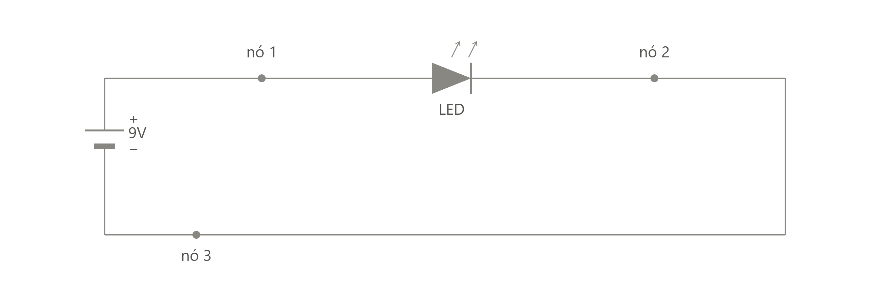

**Success criterion:** when you click “Power On,” the LED lights up and the screen displays “closed circuit ✓.”

### Challenge Version

**Initial state:** the same circuit as above, already assembled, but **with one jumper missing** (the platform decides which one, without warning).

**Goal:** The child must locate the unconnected point on their own and close the circuit.

**Success criteria:** Same as the guided version—LED lit and “circuit closed ✓”—without being told which jumper is missing, unless they make the same mistake twice in a row.

---

# Module 03 — Limiting the Current (Resistor)

### Guided Version

**Minimum Success Objective: to** understand that the resistor protects the LED by observing the resulting current value in mA.

**Components:** 1 9V battery, 1 resistor (suggested value: 470 Ω), 1 LED, 2 jumpers.

**Schematic (final state):**

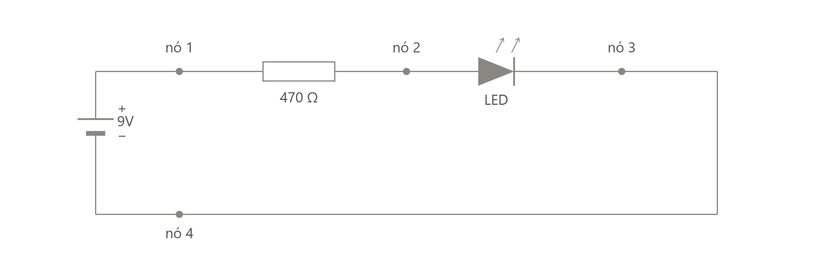

**Success Criteria:** LED is lit, with the display showing the current value in mA and the IA reinforcing the definition of the unit at that moment.

### Challenge Version

**Initial state:** the same circuit as above, but with two resistors available on the tray (e.g., 220 Ω and 1 kΩ).

**Goal:** The child predicts which resistor will make the LED dimmer, tests each one at the same node, and confirms the result visually.

**Target schematic:** identical to the guided version, with only the resistor value at that same point changed.

**Success Criteria:** The child correctly switches between the two resistors and verbally states or selects (via a button quiz) which one made the LED dimmer.

---

# Bonus Module — Resistor Color Code

### The color-code capsule

This module uses a special capsule. Unlike every other component in the kit, it is **empty**: there
is no resistor inside, only a pass-through between its two terminals. Its top face carries three
rotating discs, each divided into four colored quadrants with a printed pointer marking the
selected one. The child turns the discs to spell out a value in the resistor color code, the camera
reads the three selected quadrants from above, and the bench routes the circuit through the
matching resistor from its internal bank.

| Disc | Meaning | Quadrant colors | Digits reachable |
| --- | --- | --- | --- |
| 1st | First digit | brown, yellow, brown, yellow | 1, 4 |
| 2nd | Second digit | black, violet, black, violet | 0, 7 |
| 3rd | Multiplier | brown, red, brown, red | ×10, ×100 |

Colors alternate around each disc, so every quarter turn changes the digit. The eight reachable
values are:

| 1st digit | 2nd digit | Number | ×10 (brown) | ×100 (red) |
| --- | --- | --- | --- | --- |
| brown (1) | black (0) | 10 | **100 Ω** | **1 kΩ** |
| brown (1) | violet (7) | 17 | 170 Ω | 1.7 kΩ |
| yellow (4) | black (0) | 40 | 400 Ω | 4 kΩ |
| yellow (4) | violet (7) | 47 | **470 Ω** | **4.7 kΩ** |

> **Behind the scenes:** the bench holds these eight resistors internally and switches to the one
> the child dialed. The child is never told about the substitution — as far as the activity is
> concerned, the capsule *is* the resistor they built.

### Guided Version

**Objective:** learn how to identify the value of a resistor using its colored bands.

**Components:** 1 9V battery, 1 color-code resistor capsule, 1 LED, jumpers.

**Activity:**

- The AI presents the colors and their corresponding numbers.
- The child learns how to read the resistor bands in the correct sequence.
- The child turns the discs to spell out a value and confirms the reading against the display.
- Uses the dialed resistor in a circuit and observes the effect on the LED's brightness.

**Success criterion:** correctly dial and identify 3 different values using the color code.

### Challenge Version

**Initial state:** the capsule is already in the circuit with the discs at an arbitrary position,
and the on-screen color reference is hidden.

**Goal:** the AI requests a specific value (e.g., 470 Ω), and the child must dial it using only
the color code.

**Success criterion:** the requested value is dialed correctly and the LED lights, without the
color reference on screen.

---

# Module 04 — Direction of Current (LED)

### Guided Version

**Minimum success objective:** to realize that the LED only lights up when connected in one direction.

**Components:** 1 9V battery, 1 470 Ω resistor, 1 LED, 2 jumpers.

**Correct schematic (final state):**

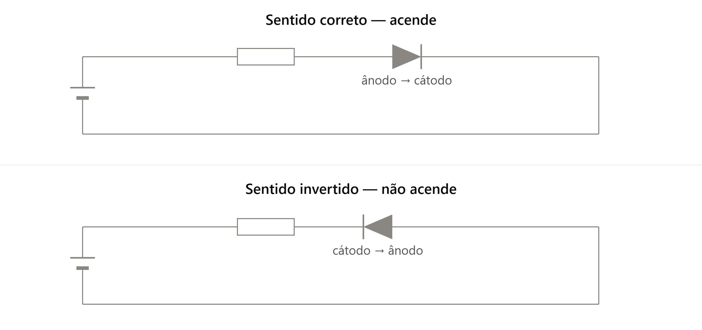

**Success criterion:** The child tests both directions and identifies which one works before the AI confirms the term “polarity.”

### Challenge Version

**Initial state:** circuit already assembled with the LED reversed, without warning.

**Goal:** Determine why it doesn’t light up and correct it on their own (by clicking on the part to rotate it).

**Target schematic:** the correct schematic shown above.

**Success criterion:** LED lit after the correction, without having been given the ready-made answer.

---

# Module 05 — Switch (Button) Control

### Guided Version

**Minimum success objective: to** understand that the pushbutton closes the circuit only while it is pressed.

**Components:** 1 9V battery, 1 470 Ω resistor, 1 LED, 1 pushbutton, jumpers.

**Schematic (final state):**

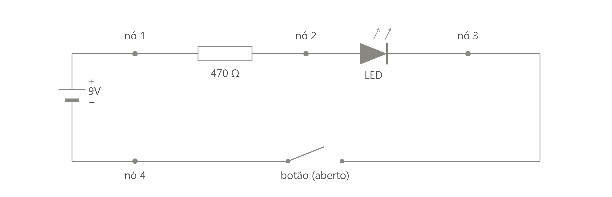

**Success criterion:** During the interaction window the LED lights up only while the pushbutton is pressed and turns off when released; the child confirms what they saw via the button quiz.

### Challenge Version

**Initial state:** tray with a battery, resistor, LED, and **two pushbuttons**.

**Goal:** Build a circuit where both buttons must be pressed at the same time for the LED to light up (an intuitive introduction to “series” connections, without using the term).

**Target Schematic:**

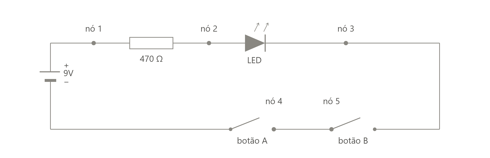
**Success criterion:** the assembled circuit matches the target schematic, and during the interaction window the LED turns on only when both buttons are pressed simultaneously; releasing either one turns it off. The child confirms the behavior via the button quiz.

---

# Module 06 — Proportional Control (Potentiometer)

### Guided Version

**Minimum success objective:** observe the LED’s brightness varying continuously as the potentiometer is turned.

**Components:** 1 9V battery, 1 potentiometer, 1 LED, jumpers.

**Schematic (final state):**

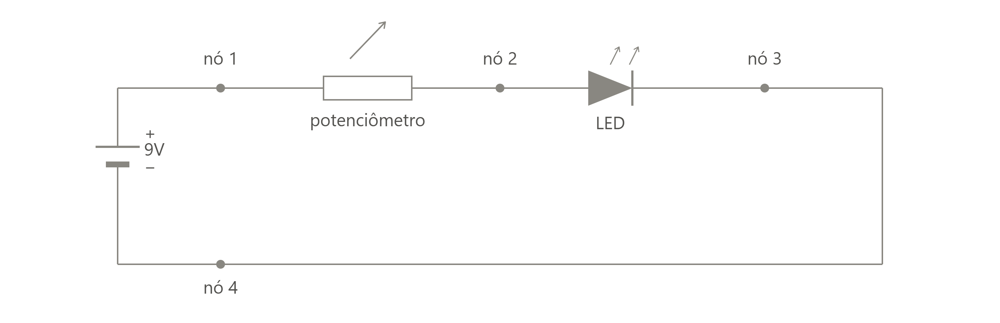

**Success criterion:** during the interaction window the LED’s brightness changes in real time as the potentiometer is turned, without any noticeable discrete steps; the child confirms the observation via the button quiz.

### Challenge Version

**Initial state:** the same circuit as in the guided version, already assembled.

**Goal:** Before turning anything, predict which way the knob must go to make the LED dimmer. Then sweep the potentiometer through its whole range during the interaction window and check the prediction.

**Target schematic:** identical to the guided version; the variable is the potentiometer’s position, not the circuit topology.

**Success criterion:** the child’s prediction (via the button quiz) matches what they observed while sweeping the knob.

---

# Module 07 — Storing Energy (Capacitor)

### Guided Version

**Minimum success objective:** observe that the LED does not turn off instantly when the power source is turned off, due to the energy stored in the capacitor.

**Components:** 1 9V battery, 1 470 Ω resistor, 1 LED, 1 capacitor, jumpers.

**Schematic (final state):**

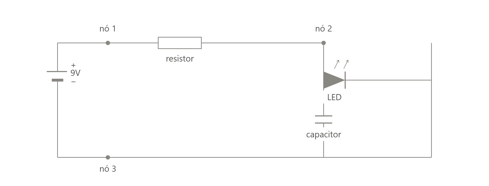

**Success criterion:** When the power supply is turned off, the LED turns off gradually, not instantly.

### Challenge Version

**Initial state:** same circuit as the guided version, with two capacitors of different values available on the tray.

**Goal:** Before turning off the power supply, predict whether the LED will turn off faster or slower with the larger capacitor—then test to confirm.

**Target Schematic:** identical to the guided version, with only the capacitor value changed at the same point.

**Success criterion:** the child’s prediction (via the button quiz) matches the result observed after the test.

---

# Module 08 — Generating Sound (Buzzer)

### Guided Version

**Minimum success objective:** to relate the variation in the resistor’s value to the change in the sound’s pitch or intensity.

**Components:** 1 9V battery, 1 resistor (variable value), 1 buzzer, jumpers.

**Schematic (final state):**

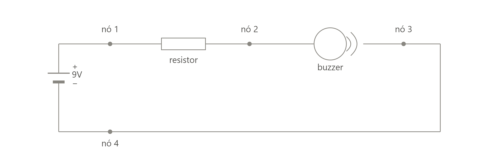

**Success criteria:** the buzzer emits sound, and the child notices a difference in pitch when changing the resistor value.

### **Potentiometer Version**

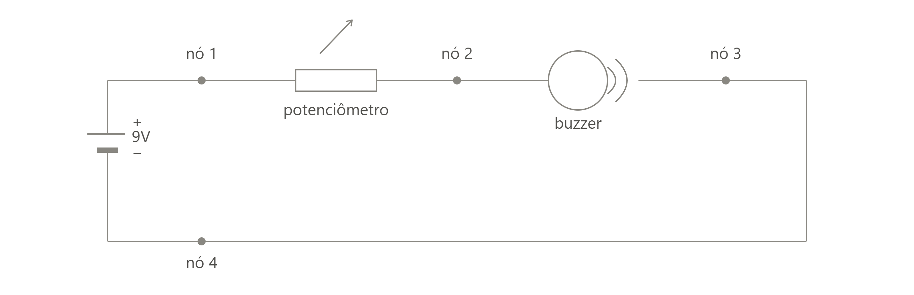

### Challenge Version

**Initial state:** two audio clips recorded of the buzzer sounds with different resistors.

**Goal:** Identify, without seeing the value, which audio clip corresponds to the higher resistor and which to the lower one.

**Target schematic:** same as the guided version—the variable is the value of the resistor being compared, not the topology.

**Success criterion:** the child correctly matches the sound to the resistor (higher/lower) via a button quiz.

---

# Module 09 — Safety, Short Circuits, and Poor Contacts

### Guided Version

**Minimum success objective:** The child learns to recognize the two most common accidents on a workbench: a **short circuit** (too much energy flowing too quickly) and a **loose connection** (energy failure due to a loose connection). The pedagogical objective is to teach visual and tactile diagnosis and damage prevention before allowing free creation.

- **Guided Practice:**
    1. **Simulating a poor connection (to recognize the symptom):**
        - The AI presents a simple circuit with a jumper plug that is only “halfway” inserted.
        - **Action:** Click on the slightly loose jumper to see the LED flash erratically.
        - **Success verification:** Insert the jumper all the way. The LED stops flashing and stays fully lit.
    2. **Inducing a controlled short circuit (to see the alarm in action):**
        - The AI asks the child to connect a jumper directly from the battery’s **positive** terminal to the **negative** terminal, bypassing the resistor and the LED.
        - **Action:** Drag the jumper to connect the **positive** terminal to the negative terminal **.** Click “Power On.”
        - **Effect:** The screen flashes an alert, the system automatically cuts off the power, and the mascot reacts instantly.
        - **Success verification:** Remove the jumper and replace the resistor. Click “Power On” to see the circuit return to normal.
- **Step-by-step diagnostic procedure:**
    1. **Identify a loose connection (bad contact):** check the circuit for jumpers or component leads that are out of their correct columns or only partially seated.
    2. **Remove open-circuit bypasses (short-circuit prevention):** Ensure that no wire connects the positive (+) terminal directly to the negative (-) terminal without passing through at least one resistor.
    3. **Re-energize and test (validation):** Turn the power supply back on and check that the LED remains steady, without flickering.

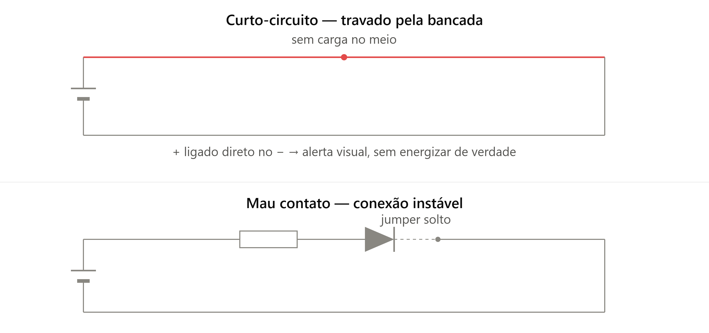
The instructor presents a pre-assembled circuit board with **two simultaneous errors**:

1. A short-circuited jumper (connecting + and - directly at one corner of the matrix).
2. An LED with a poor connection (inserted into a crooked socket).

**Child’s challenge:** Fix the circuit board so that the LED lights up safely without triggering the short-circuit alarm.

---

# Module 10 — Integrator Challenge (Alarm)

### Guided Version

**Minimum success objective:** integrate a button, resistor, LED, and buzzer into a single functional system, with minimal AI support (it only intervenes after 2 consecutive failed attempts at the same step).

> Block 1: “Now you’re going to build an alarm: when you press the button, the LED turns on AND the buzzer sounds at the same time. You already know how to set up each of these parts—the new challenge is putting them all together.”

**Components:** 1 9V battery, 1 pushbutton, 2 resistors, 1 LED, 1 buzzer, jumpers.

**Schematic (final state):**

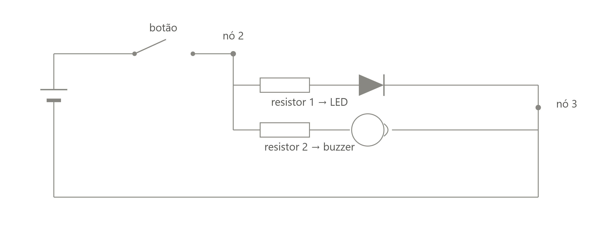

**Success criteria:** When you press the pushbutton, the LED lights up and the buzzer sounds at the same time.
