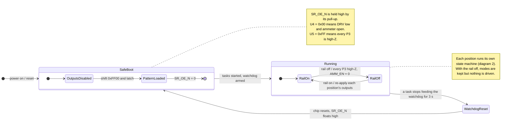
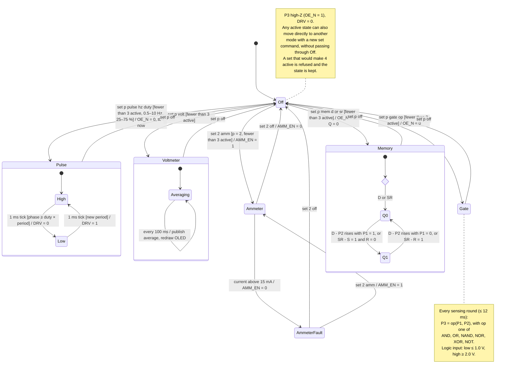
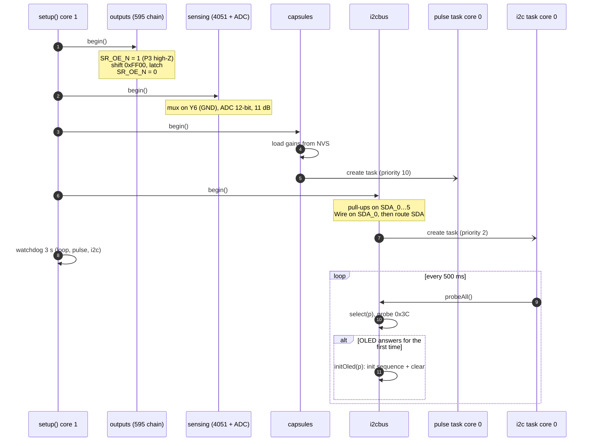
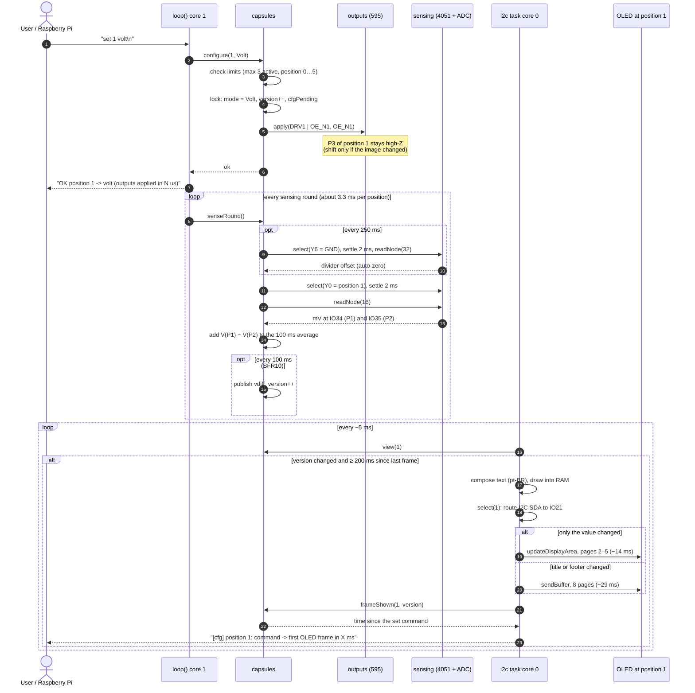
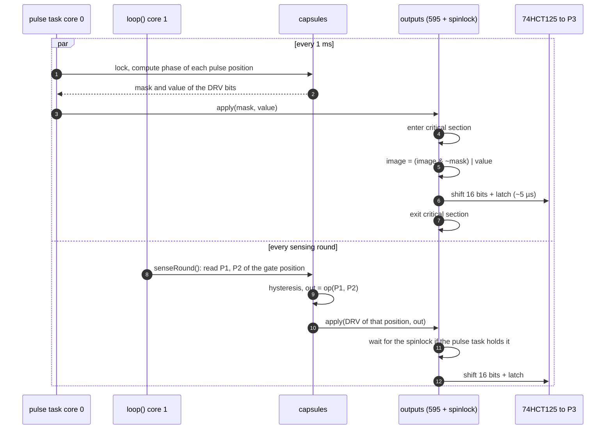
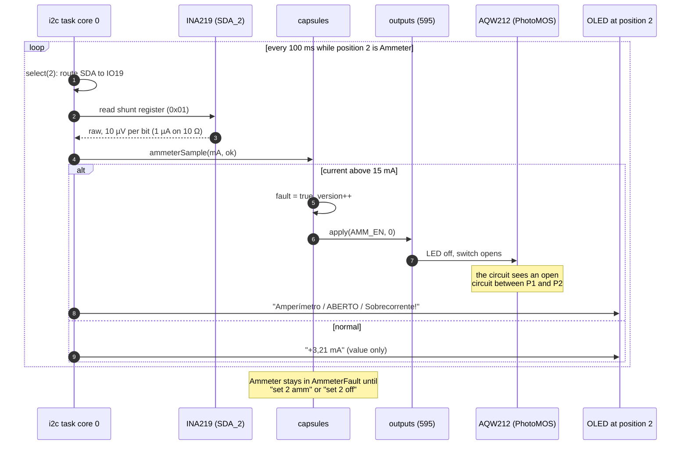

# Smart components firmware — UML

State machine and sequence diagrams for `smart_components/` (ESP32, 6 positions,
max 3 active). Mermaid renders on GitHub and in Notion (`/code` block → Mermaid).

Names in the diagrams match the code: `capsules::configure`, `outputs::apply`,
`sensing::readNode`, the `pulse` and `i2c` tasks, and so on.

---

## 1. State machine — system (boot, rail, watchdog)

## 2. State machine — one position (p = 0…5)

---

## 3. Sequence — boot

## 4. Sequence — `set 1 volt` until the value is on the OLED

## 5. Sequence — pulse and gate sharing the 595 chain

The pulse task (core 0) and the sensing loop (core 1) both write the same
16-bit shift-register image. A spinlock makes each update atomic.

## 6. Sequence — ammeter over-current

---

PNG exports (1600 px wide) are in `uml/`. To regenerate after editing this file,
render each Mermaid block with `mmdc` (`@mermaid-js/mermaid-cli`).
